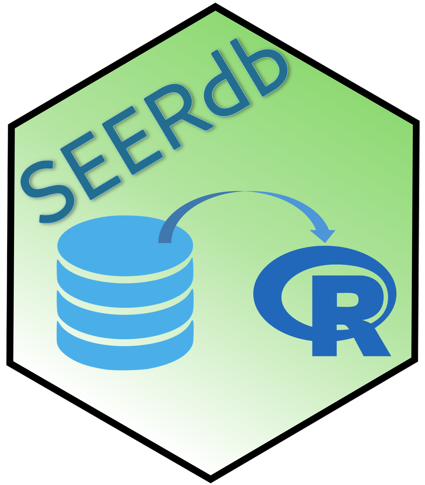

# SEERdb 

## Overview

SEERdb is a package for accessing data from the SEER medicare dataset.
It expects a directory where SEER medicare zipped files are stored.
Functions can open these files or build a SQLite database.

## File types

Thse are the given file types:

- hsp
  - demo
  - occurence
  - revenue
  - span
  - value
- msbf
  - ab.summary
  - abcd.summary
  - cc.summary
  - oth.cc.summary
- medpar
- nch
  - base
  - line
  - demo
- outpat
  - base
  - condition
  - occurence
  - revenue
  - span
  - value
- SEER
  - colon
  - lung
- census
  - tract.encr
  - zipcode.unencr
